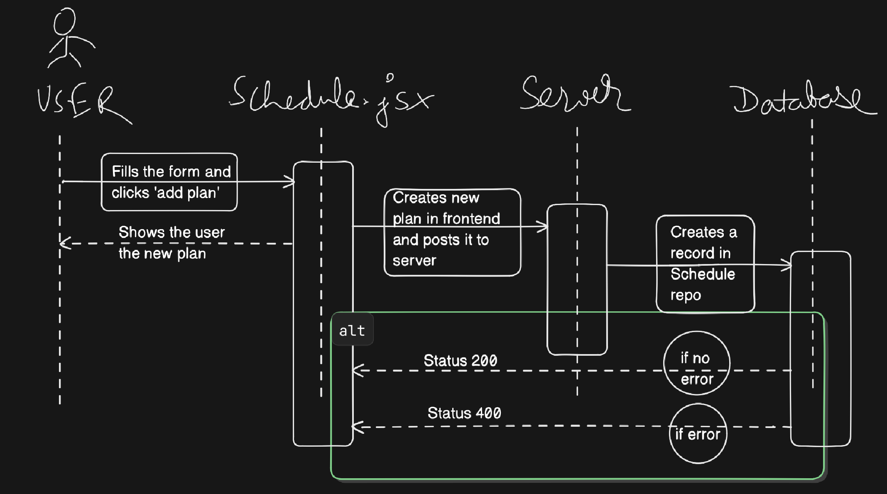

# Workout Tracker
## This is the workout tracker project created by me using MERN stack.
Website link - https://workout-tracker-5ym.pages.dev/

*Many people going to the gym or doing calisthenics don't even note their current status. They just keep on doing the same things they did the previous week and the week before it.
*To solve this people need to track their workouts by noting or saving them down.
*Workout Tracker does the exact thing. You can add your routine with daily plans in here to know what to do next. You can now do Progressive Overload 'efficiently' and 'cleanly'.

## Tech Stack used:
* Frontend - React
* Backend - Express
* Database - MongoDB

More features will come hopefully come soon!

## Setup Process

To run this project locally, follow these steps:

### Prerequisites
- [Node.js](https://nodejs.org/) installed on your machine
- [MongoDB](https://www.mongodb.com/) running locally or a MongoDB Atlas URI

### 1. Install Dependencies
```bash
# Install frontend dependencies (root directory)
npm install

# Install backend dependencies
cd backend
npm install
cd ..
```

### 2. Configure Environment Variables

**Backend Variables**
Create a `.env.development` file inside the `backend/` directory:
```env
PORT=4000
MONGO_URI=mongodb://127.0.0.1:27017/workout-tracker
NODE_ENV='development'
```
*(Change the `MONGO_URI` if you are using a different local or cloud database).*

**Frontend Variables**
Create a `.env.development` file in the root directory:
```env
VITE_API_BASE_URL=http://localhost:4000
```

### 3. Run the Application
From the root directory, start both the frontend and backend servers concurrently:
```bash
npm run dev
```
The frontend will typically run on `http://localhost:5173` and the backend will run on `http://localhost:4000`.

---

Screenshots of the website-


A sample Sequence Diagram to 'Add a plan'

